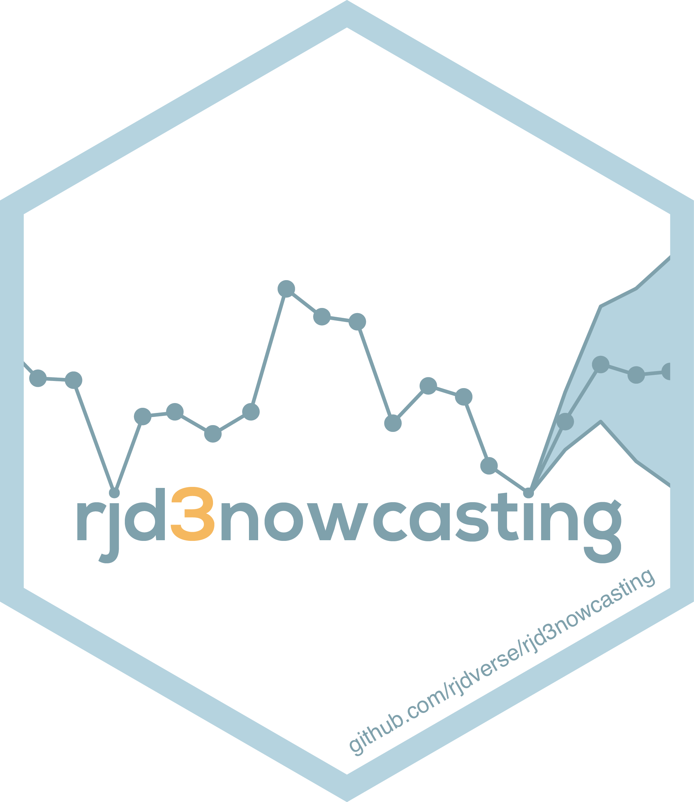
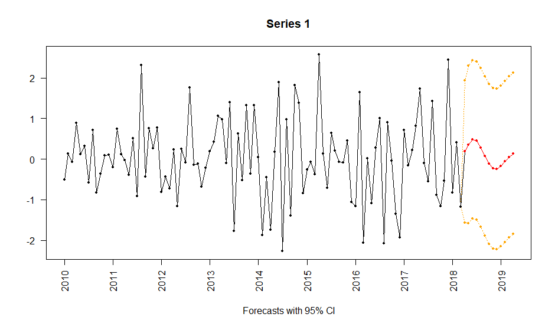

<!-- README.md is generated from README.Rmd. Please edit that file -->

# `rjd3nowcasting` <a href="https://rjdverse.github.io/rjd3nowcasting/"></a>

<!-- badges: start -->

[](https://CRAN.R-project.org/package=rjd3nowcasting)

[](https://github.com/rjdverse/rjd3nowcasting/actions/workflows/R-CMD-check.yaml)
[](https://github.com/rjdverse/rjd3nowcasting/actions/workflows/lint.yaml)

[](https://github.com/rjdverse/rjd3nowcasting/actions/workflows/pkgdown.yaml)
<!-- badges: end -->

## Overview

Nowcasting is often defined as the prediction of the present, the very
near future and the very recent past.

rjd3nowcasting provides helps to operationalize the process of
nowcasting. This first version can be used to specify and estimate
dynamic factor models. It also includes the
concept of “news” similar to the [Nowcasting
plugin](https://github.com/nbbrd/jdemetra-nowcasting/tree/master) for
the Graphical User Interface of JDemetra+ v2.

## Installation

Running rjd3 packages requires **Java 17 or higher**. How to set up such
a configuration in R is explained
[here](https://jdemetra-new-documentation.netlify.app/#Rconfig)

To get the current stable version (from the latest release):

``` r
# install.packages("remotes")
remotes::install_github("rjdverse/rjd3toolkit@*release")
remotes::install_github("rjdverse/rjd3nowcasting@*release", build_vignettes = TRUE)
```

To get the current development version from GitHub:

``` r
# install.packages("remotes")
remotes::install_github("rjdverse/rjd3nowcasting", build_vignettes = TRUE)
```

## Usage

``` r
library("rjd3nowcasting")
```

### Input

``` r
set.seed(100)
data <- ts(
    data = matrix(rnorm(500), 100, 5), 
    frequency = 12, 
    start = c(2010, 1)
)
data[100, 1] <- data[99:100, 2] <- data[(1:100)[-seq(3, 100, 3)], 5] <- NA
```

### Model

``` r
dfm_model <- model(
    nfactors = 2,
    nlags = 2,
    factors_type = c("M", "M", "YoY", "M", "Q"),
    factors_loading = matrix(data = TRUE, 5, 2),
    var_init = "Unconditional"
)
```

### Estimation

``` r
rslt_ml <- estimate_ml(dfm_model, data)
# or rslt_em<-estimate_em(dfm_model, data)
# or rslt_pca<-estimate_pca(dfm_model, data)
```

### Results

``` r
fcst <- get_forecasts(rslt_ml, nf = 2, forecasts_only = TRUE)
params <- get_parameters(rslt_ml)
factors <- get_factors(rslt_ml)
# ...

print(rslt_ml)
#> Measurement:
#>          Sample mean Sample Stdev Coeff. of normalized factor F1
#> Series 1     0.01480      1.01376                        0.11234
#> Series 2     0.01656      0.79045                       -0.07066
#> Series 3     0.01279      1.03407                        0.00171
#> Series 4    -0.08325      1.07544                       -0.00624
#> Series 5    -0.21205      1.06909                       -0.00302
#>          Coeff. of normalized factor F2 Idiosyncratic variance
#> Series 1                        0.55341                0.41091
#> Series 2                       -0.06925                0.93488
#> Series 3                        0.04849                0.98831
#> Series 4                        0.03340                0.99792
#> Series 5                       -0.33934                0.00000
#> 
#> State:
#> VAR coefficients:
#>      F1[-1]   F2[-1]   F1[-2]   F2[-2]
#> F1  1.44836 -0.97181 -0.76117  1.23216
#> F2 -0.02442 -0.59011 -0.02834 -0.09459
#> 
#> Innovative variance:
#>    F1 F2
#> F1  1 -1
#> F2 -1  1
```

``` r
summary(rslt_ml)
#> Nowcasted values (only):
#>           Series 1     Series 2 Series 3 Series 4  Series 5
#> Mar 2018        NA 0.3198988965       NA       NA        NA
#> Apr 2018 0.1827459 0.0001724063       NA       NA -2.427725
```

``` r
plot(rslt_ml)
```



## Package Maintenance and contributing

Any contribution is welcome and should be done through pull requests
and/or issues. pull requests should include **updated tests** and
**updated documentation**. If functionality is changed, docstrings
should be added or updated.

## Licensing

The code of this project is licensed under the [European Union Public
Licence
(EUPL)](https://joinup.ec.europa.eu/collection/eupl/eupl-text-eupl-12).
