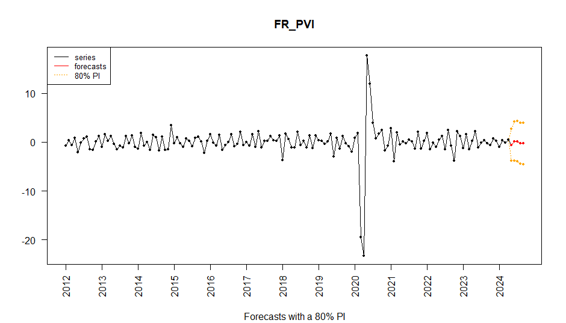
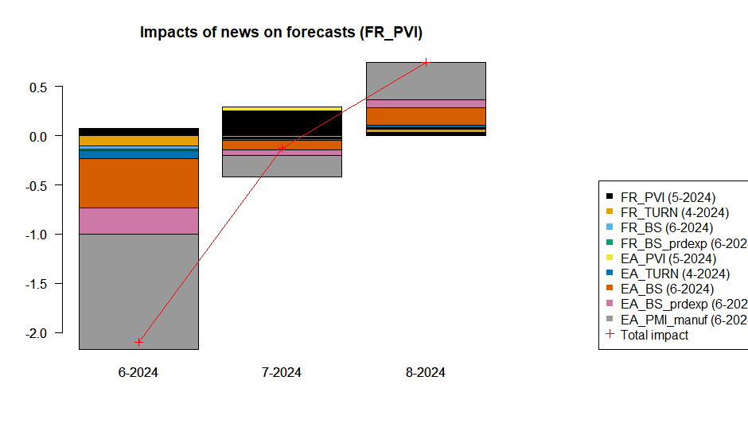

<!-- README.md is generated from README.Rmd. Please edit that file -->

# `rjd3nowcasting` <a href="https://rjdverse.github.io/rjd3nowcasting/"></a>

<!-- badges: start -->

[](https://CRAN.R-project.org/package=rjd3nowcasting)

[](https://github.com/rjdverse/rjd3nowcasting/actions/workflows/R-CMD-check.yaml)
[](https://github.com/rjdverse/rjd3nowcasting/actions/workflows/lint.yaml)

[](https://github.com/rjdverse/rjd3nowcasting/actions/workflows/pkgdown.yaml)
<!-- badges: end -->

## Overview

Nowcasting is often defined as the prediction of the present, the very
near future and the very recent past.

rjd3nowcasting provides helps to operationalize the process of
nowcasting. It can be used to specify and estimate Dynamic Factor
Models. Recent version of the package also includes news analysis. The
way the package was conceived is inspired by the [GUI
add-in](https://github.com/nbbrd/jdemetra-nowcasting) developed for
JDemetra+ V2.

## Installation

Running rjd3 packages requires **Java 17 or higher**. How to set up such
a configuration in R is explained
[here](https://jdemetra-new-documentation.netlify.app/#Rconfig)

### Latest release

To get the current stable version (from the latest release):

- From GitHub:

``` r
# install.packages("remotes")
remotes::install_github("rjdverse/rjd3toolkit@*release")
remotes::install_github("rjdverse/rjd3nowcasting@*release", build_vignettes = TRUE)
```

- From [r-universe](https://rjdverse.r-universe.dev/rjd3nowcasting):

``` r
install.packages("rjd3nowcasting", repos = c("https://rjdverse.r-universe.dev", "https://cloud.r-project.org"))
```

### Development version

You can install the development version of **rjd3nowcasting** from
[GitHub](https://github.com/) with:

``` r
# install.packages("remotes")
remotes::install_github("rjdverse/rjd3nowcasting")
```

## Usage

``` r
library("rjd3nowcasting")
```

Once the package is loaded, there are four steps to follow:

1.  Import data
2.  Create or update the model
3.  Estimate the model
4.  Get results

Detailed information concerning each step can be found in the vignette.

### 1. Input

``` r
data("data0", "data1")
data0_ts<-ts(data0[,-1], start=c(2012,1), frequency = 12)
data1_ts<-ts(data1[,-1], start=c(2012,1), frequency = 12)
```

### 2. Create or update the model

``` r
### Create a model from scratch
ns<-ncol(data0_ts)
types<-c("M","M","Q","YoY","YoY","M","M","YoY","YoY","YoY")
loadings1<-matrix(data=TRUE, ns, 2)
#loadings2<-matrix(data=c(rep(TRUE,ns+5),rep(FALSE,5)), ns, 2)
dfm0_init <- create_model(nfactors=2,
                          nlags=2,
                          factors_type = types,
                          factors_loading = loadings1,
                          var_init = "Unconditional")

### Update an existing model
est0 <- estimate_em(dfm0_init, data0_ts) # cfr. next step
dfm1_init <- est0$dfm # R object (list) to save from one time to another 
# or, equivalently,
# dfm1_init <- create_model(nfactors=2,
#                           nlags=2,
#                           factors_type = types,
#                           factors_loading = loadings1,
#                           var_init = "Unconditional",
#                           var_coefficients = est0$dfm$var_coefficients,
#                           var_errors_variance = est0$dfm$var_errors_variance,
#                           measurement_coefficients = est0$dfm$measurement_coefficients,
#                           measurement_errors_variance = est0$dfm$measurement_errors_variance)
```

### 3. Estimate the model

``` r
est0 <- estimate_ml(dfm0_init, data0_ts)
# or est0<-estimate_em(dfm0_init, data0_ts)
# or est0<-estimate_pca(dfm0_init, data0_ts) # to be avoided unless you only have monthly data 
```

### 4. Get results

#### Model and forecasts

``` r
rslt0 <- get_results(est0)
print(rslt0)
#> $loadings
#>              Sample mean Stdev Coeff. F1 Coeff. F2 Idiosyncratic variance
#> FR_PVI            -0.018 3.347     0.651     0.630                  0.150
#> FR_TURN            0.178 3.915     0.621     0.603                  0.219
#> FR_B1g_BCDE        0.110 4.219     0.145     0.141                  0.257
#> FR_BS             -5.962 6.726     0.212     0.006                  0.126
#> FR_BS_prdexp       7.933 9.487     0.183     0.031                  0.419
#> EA_PVI             0.027 2.695     0.646     0.627                  0.162
#> EA_TURN            0.190 3.122     0.653     0.638                  0.131
#> EA_BS             -2.056 8.037     0.236     0.045                  0.048
#> EA_BS_prdexp       8.349 9.070     0.235     0.100                  0.173
#> EA_PMI_manuf      51.313 5.111     0.249     0.170                  0.109
#> 
#> $VAR_model
#>    F1[-1] F2[-1] F1[-2] F2[-2]
#> F1  0.710 -0.253 -0.690  0.260
#> F2 -0.508  0.489  0.333 -0.624
#> 
#> $Innovative_variance
#>        F1     F2
#> F1  1.000 -0.151
#> F2 -0.151  1.000

fcsts0 <- get_forecasts(est0, n_fcst = 3)
print(fcsts0)
#> $forecasts_only
#>              FR_PVI     FR_TURN FR_B1g_BCDE     FR_BS FR_BS_prdexp     EA_PVI
#> Apr 2024         NA -0.26520376  -0.9066921        NA           NA         NA
#> May 2024 -0.5557794 -0.41682622  -1.0911187        NA           NA -0.3988934
#> Jun 2024  0.1699863  0.36989280  -0.5998834 -9.138949     3.915219  0.1656424
#> Jul 2024  0.1685482  0.36225137  -0.5747306 -6.960827     6.381705  0.1606429
#> Aug 2024 -0.2416552 -0.07873533  -0.1738075 -6.907477     6.470485 -0.1560932
#> Sep 2024 -0.2809204 -0.09964879  -0.0680737 -8.495403     4.882437 -0.1728226
#>               EA_TURN     EA_BS EA_BS_prdexp EA_PMI_manuf
#> Apr 2024 -0.111319199        NA           NA           NA
#> May 2024 -0.291450017        NA           NA           NA
#> Jun 2024  0.301963860 -6.471711     3.067721     47.94640
#> Jul 2024  0.278853788 -3.807055     5.688887     49.26765
#> Aug 2024 -0.043318670 -3.706038     5.851589     49.39729
#> Sep 2024  0.002645719 -5.383872     4.670237     49.15457
plot(fcsts0, series_name = "FR_PVI")
```



``` r
# Note: impact of Covid-19 on the model estimate could be eliminated by treating affected indicators as missing data during this period. This has not been done in this example. 
```

#### News analysis

``` r
news1 <- get_news(est0, data1_ts, target_series = "FR_PVI", n_fcst = 3)
news1$impacts
#>          series period      expected_value     observed_value
#> 1        FR_PVI 5-2024  -0.551604008710279  -2.10323226057412
#> 2       FR_TURN 4-2024  -0.158827203273009    1.5012792389185
#> 3         FR_BS 6-2024   -9.16421530477352               -7.9
#> 4  FR_BS_prdexp 6-2024    3.89240182586572                2.3
#> 5        EA_PVI 5-2024  -0.395537116403581 -0.615386557437869
#> 6       EA_TURN 4-2024 -0.0213558345482549  0.606324941105818
#> 7         EA_BS 6-2024   -6.49531828333652              -10.1
#> 8  EA_BS_prdexp 6-2024    3.05743620889786                0.5
#> 9  EA_PMI_manuf 6-2024    47.9509402506111               45.8
#> 10        TOTAL   <NA>                <NA>               <NA>
#>                  news     impacts(6-2024)      impacts(7-2024)
#> 1   -1.55162825186384  0.0625426516614255     0.25062588561052
#> 2     1.6601064421915  -0.102937609850668  -0.0213553608864313
#> 3    1.26421530477352 -0.0324518053679323 -0.00408631517117787
#> 4   -1.59240182586572  -0.013283314097744 -0.00280694611263804
#> 5  -0.219849441034288 0.00987846987975813   0.0404545554456015
#> 6   0.627680775654073 -0.0853868086082372  -0.0178364405879784
#> 7   -3.60468171666348  -0.496517141653302   -0.101958959531745
#> 8   -2.55743620889786  -0.267633977600985  -0.0504429432184094
#> 9    -2.1509402506111   -1.17139914720656   -0.216781814558934
#> 10               <NA>   -2.09718868284424   -0.124188339011193
#>        impacts(8-2024)
#> 1   0.0349315424038756
#> 2   0.0315210711205507
#> 3  0.00797192122461071
#> 4  0.00468621804722846
#> 5  0.00571578862082551
#> 6   0.0254483699135738
#> 7    0.171450179562596
#> 8   0.0867506968615175
#> 9    0.374677629475995
#> 10   0.743153417230773
news1$forecasts
#>                       6-2024     7-2024     8-2024
#> old_forecasts      0.1699863 0.16854824 -0.2416552
#> revised_forecasts  0.1376619 0.15925989 -0.2335544
#> new_forecasts     -1.9595268 0.03507155  0.5095990
plot(news1)
```



## Package Maintenance and contributing

Any contribution is welcome and should be done through pull requests
and/or issues. pull requests should include **updated tests** and
**updated documentation**. If functionality is changed, docstrings
should be added or updated.

## Licensing

The code of this project is licensed under the [European Union Public
Licence
(EUPL)](https://joinup.ec.europa.eu/collection/eupl/eupl-text-eupl-12).
